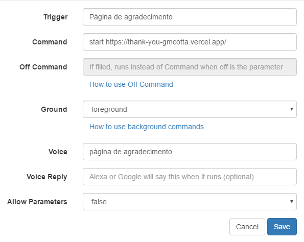

# Thank-you


A simple thank you page using [React](https://pt-br.reactjs.org/), [react-lottie](https://github.com/chenqingspring/react-lottie) and [react-canvas-confetti](https://github.com/ulitcos/react-canvas-confetti).

Animation used: https://lottiefiles.com/11405-thank-you

## How to run

Clone this repository.

```git clone https://github.com/gmcotta/thank-you.git```


Install the dependencies.

```npm install``` or ```yarn```

Run the webapp.

```npm start``` or ```yarn start```

## Using Alexa to open the app

I'm using [this video](https://www.youtube.com/watch?v=FTxIabp8CRg&ab_channel=Felps) (it is in Portuguese) as a guide for this.

I deployed the app on Vercel, then, on the TRIGGERcmd GUI, I added to command to open the address of the app on the browser.

